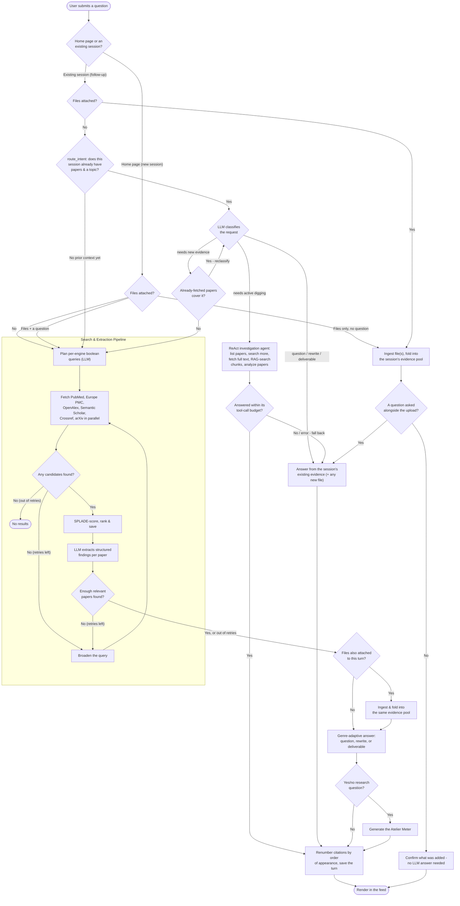

# 🏛️ Atelier

> An open-source, AI-powered academic research synthesizer and literature copilot — a Consensus.app-style alternative you can run yourself.

[](https://colab.research.google.com/github/damurka/atelier/blob/main/atelier-demo.ipynb)
[](LICENSE)
[]()
[]()

**Atelier** takes a natural-language research question, plans engine-specific boolean queries with an LLM, concurrently searches six academic databases, ranks candidates with a local sparse-vector model weighted by citation count and study design, extracts structured per-paper metadata, and writes a fully cited, abstract-style synthesis — all through a reactive Dash single-page app with a resumable, checkpointed pipeline underneath.

## ✨ Core Features

* 🧠 **LLM-Orchestrated Pipeline:** A [LangGraph](https://github.com/langchain-ai/langgraph) state machine plans queries, searches, ranks, extracts, and synthesizes - checkpointed via SQLite so an interrupted run resumes exactly where it left off instead of restarting from scratch.
* 🔍 **Six-Engine Retrieval:** Searches **PubMed**, **Europe PMC**, **OpenAlex**, **Semantic Scholar**, **Crossref**, and **arXiv** in parallel, merges and deduplicates by a global fingerprint (DOI/PMID/PMCID/arXiv ID), and surfaces per-engine failures instead of silently under-reporting.
* 📊 **Quality-Weighted Ranking:** Relevance scoring blends SPLADE sparse-vector similarity with citation count, recency, and a study-type evidence tier (systematic review > RCT > cohort > case report, etc.) - not just topical match.
* 📐 **Context-Aware RAG Budgets:** How much full-text content gets pulled into extraction, synthesis, and the investigation agent's tool calls scales with the *selected model's own context window* (fetched live from OpenRouter/Google, where available) - a huge-context model like Gemini genuinely gets more material to work with per paper, not the same fixed slice a small model gets.
* 🧭 **Atelier Meter:** For yes/no-shaped research questions, a weighted agreement bar shows how the literature actually leans, with each paper's vote weighted by its evidence tier and citation count rather than counted equally.
* ✍️ **Genre-Adaptive Synthesis:** Your very first question and every follow-up go through the same prompt: ask a plain question and get a direct, closed-book answer; ask for a rewrite of your own pasted draft and get it strengthened with citations woven in; ask for a specific deliverable ("write a 300-word abstract", "write a structured report") and get that genre's real conventions, not a fixed template - no result is forced into a one-size-fits-all format regardless of what you actually asked for.
* 💬 **Context-Aware Follow-Ups:** A router classifies each follow-up as a new SEARCH, a context-only CHAT, or an active INVESTIGATE. Follow-ups first check papers your original search already found but didn't extract before falling back to a full new external search.
* 🕵️ **Deep-Dive Investigation Agent:** A LangGraph ReAct tool-calling agent for follow-ups that need active digging rather than just answering from what's already on screen - it can search for more papers, fetch a specific paper's full text, run a RAG search over already-fetched full-text chunks, and analyze multiple papers in parallel, citing exactly what it actually used. Falls back to plain context-aware chat if the agent itself fails.
* 📄 **Per-Paper AI Summaries:** Click any paper for a topic-focused summary, its full author list, a link to the journal (via DOI), and an in-app PDF viewer - summaries are cached per session so re-opening a paper is instant.
* 📥 **Reference Export:** Download citations as BibTeX or RIS, either the whole turn's reference list (selection-aware) or a single paper at a time - compatible with Zotero, EndNote, and Mendeley.
* 📑 **PDF Export:** Download any turn - synthesis, investigation answer, or chat reply - as a formatted PDF with its full reference list, generated with no native rendering dependencies (pure-Python `markdown` + `xhtml2pdf`).
* 🔢 **Appearance-Ordered Citations:** Each turn's `[N]` citation numbers are renumbered by where they actually first appear in that turn's own generated text, not by pre-assigned relevance rank - so numbering always reads top-to-bottom in-order, and overlapping papers across turns don't force the same numbering everywhere.
* 🔄 **Load More:** Pull additional already-ranked candidates into an existing turn's evidence library on demand, without re-running the search.
* 🎨 **Reactive Dash UI:** TailwindCSS-styled frontend with interactive citation hover-popups, study-type filter chips, a collapsible per-turn Evidence Library that auto-collapses older turns and keeps the active one in view, live session status, and asynchronous background execution that survives page navigation.
* 🔐 **Encrypted, UI-Configurable Keys:** Add LLM and academic-API keys from the in-app Settings page - encrypted at rest, no restart required.

## 🛠️ Tech Stack

* **Pipeline:** [LangGraph](https://github.com/langchain-ai/langgraph) `StateGraph` with a `SqliteSaver` checkpointer, keyed per session *and* per follow-up topic so genuinely different searches never replay stale results.
* **Investigation Agent:** LangGraph's `create_react_agent` (prebuilt ReAct loop) over a custom toolset (`pipeline/agent_tools.py`), checkpointed the same way as the main pipeline so a long investigation can resume mid-way.
* **Frontend:** Plotly Dash, TailwindCSS, custom clientside JavaScript (citation popovers, PDF viewer, filter chips, results accordion + active-turn auto-scroll)
* **Backend:** Python, SQLAlchemy ORM
* **PDF Export:** `markdown` + `xhtml2pdf` (pure-Python, no native GTK/Pango/Cairo dependency)
* **Database:** SQLite (WAL mode) - structured metadata, SPLADE sparse vectors, and full-text chunks for RAG-grounded extraction/synthesis
* **Embeddings:** SPLADE sparse encoder (`sentence-transformers`) for relevance scoring and chunk-level retrieval
* **LLM Providers:** Any OpenAI-compatible provider - OpenRouter, LM Studio (local), or others - configured per-request as `provider:model`
* **APIs:** NCBI E-utilities, Europe PMC REST, OpenAlex, Semantic Scholar Graph, Crossref, arXiv

## 🚀 Installation

Atelier is a [uv](https://docs.astral.sh/uv/) project - dependencies are declared in `pyproject.toml` and pinned in `uv.lock`.

### 1. Clone the repository

```bash
git clone https://github.com/damurka/atelier.git
cd atelier
```

### 2. Install uv (if you don't have it)

```bash
curl -LsSf https://astral.sh/uv/install.sh | sh
```

### 3. Install dependencies

```bash
uv sync
```

This creates `.venv` and installs every pinned dependency into it (including `diskcache` for Dash's background callbacks, and `langgraph-checkpoint-sqlite` for pipeline resumability) - no separate venv-creation or activation step needed; `uv run` (below) uses `.venv` automatically.

## ⚙️ Configuration

Atelier requires at least one LLM provider key to run; academic-API keys (OpenAlex, Semantic Scholar) are optional and only raise rate limits. PubMed, Europe PMC, Crossref, and arXiv need no key at all.

The easiest way to configure keys is the in-app **Settings** page (`/settings`) once the server is running - keys are encrypted at rest (see `docs/adr/0001-local-encryption-key-for-ui-settings.md`), take priority over `.env`, and apply immediately with no restart. `.env` remains a supported fallback:

1. Create a `.env` file in the root directory:

```bash
cp .env.example .env
```

2. Add your API keys to the `.env` file:

```.env
# Academic APIs (optional - raise rate limits, don't gate search)
OPENALEX_API_KEY=your_openalex_key
SEMANTIC_SCHOLAR_API_KEY=your_s2_key

# LLM Provider (at least one required - see llm/model_catalog.py for the
# full provider list; models are selected in-app as "provider:model")
OPENROUTER_API_KEY=your_openrouter_key
```

## 💻 Usage

Start the Atelier server:

```bash
uv run python app.py
```

1. Open your browser and navigate to http://localhost:8050.
2. Type a research question into the search bar (e.g., ***"What are the socioeconomic barriers to breast cancer screening in sub-Saharan Africa?"***).
3. Atelier plans the search, fetches papers from all six engines, ranks and extracts the most relevant ones, and generates a fully cited, abstract-style synthesis - plus an Atelier Meter if the question is yes/no-shaped.
4. Ask follow-ups in the same thread: pointed questions, "rewrite this paragraph with the evidence," "write me a 300-word abstract," or something that needs active digging ("find more papers on X and compare them") - Atelier routes each one to the right mode automatically.
5. Download any turn as a PDF, or export its references as BibTeX/RIS, from that turn's header.

## 🧭 How the AI Pipeline Decides

Every question - your first one or a tenth follow-up, typed or attached as a document - goes through the same decision tree. Nothing is hardcoded to "first message always gets a search" or "an upload always answers alone": what actually happens depends on what you gave it and what the session already knows.



A few of the less obvious decision points:

* **A first message with both an attachment and a real question runs a real search too** - it doesn't just answer from the upload. An uploaded document enriches the literature search (grey literature/project briefs journals won't have), it doesn't replace one that should have happened.
* **`route_intent`'s "needs new evidence" guess isn't final** - before committing to a full external search, it checks whether papers the original search already found but ranked too low to extract happen to cover the follow-up, and reclassifies as CHAT/INVESTIGATE if so. Much cheaper than a fresh multi-engine search, and only spent when the cheap classification already leans that way.
* **The investigation agent isn't the only INVESTIGATE outcome** - if it hits its tool-call budget or errors out, it falls back to a plain context-aware answer instead of surfacing a dead end.
* **The Atelier Meter is opportunistic, not automatic** - only yes/no-shaped questions get one; everything else skips straight to citation rendering.

## 🏗️ Architecture Overview

* `pipeline/`: The research workflow as a LangGraph `StateGraph` (`graph.py`/`nodes.py`), orchestrated by `orchestrator.py`. Checkpointed via SQLite so an interrupted or resumed run picks up from its last completed node. `agent.py`/`agent_tools.py` hold the separate ReAct investigation agent used for deep-dive follow-ups.
* `search/`: Object-oriented API wrappers for all six engines (`paper.py`), a throttled/retrying `HttpClient`, and the SPLADE-based sparse-vector scorer (`sparse_encoder.py`).
* `llm/`: The LLM engine - query planning, batched per-paper extraction, abstract-style synthesis, the Atelier Meter, conversational follow-ups, and per-paper summaries.
* `database/`: SQLAlchemy models and a repository layer abstracting all persistence, including hybrid text/vector local recall and full chat history.
* `core/`: Cross-cutting utilities - text/URL/citation normalization (`utils.py`), global logging setup (`logger.py`), encrypted key storage (`secrets.py`), and BibTeX/RIS/PDF export (`export.py`/`pdf_export.py`).
* `ui/`: Dash layouts, Tailwind styling, and reactive callbacks - background jobs are gated through a session-aware store so a job for one session can never silently overwrite what a user has since navigated to in the same tab.
* `docs/adr/`: Architecture decision records for the non-obvious design choices.

## 🤝 Contributing

Contributions are what make the open-source community such an amazing place to learn, inspire, and create.

1. Fork the Project
2. Create your Feature Branch (`git checkout -b feature/AmazingFeature`)
3. Commit your Changes (`git commit -m 'Add some AmazingFeature'`)
4. Push to the Branch (`git push origin feature/AmazingFeature`)
5. Open a Pull Request

## 📄 License

Distributed under the MIT License. See LICENSE for more information.
